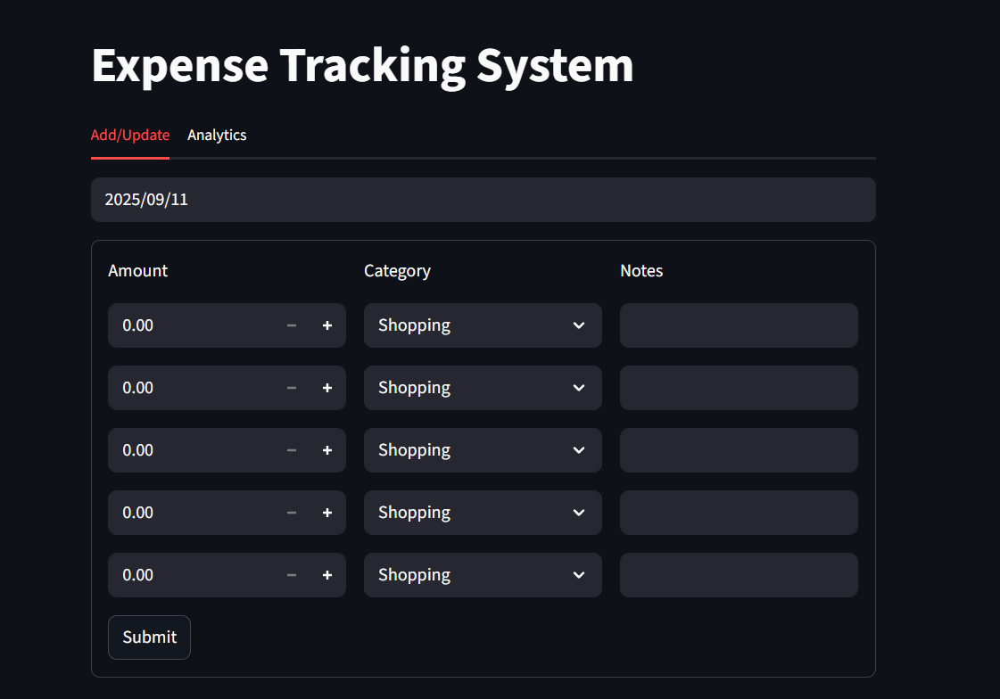
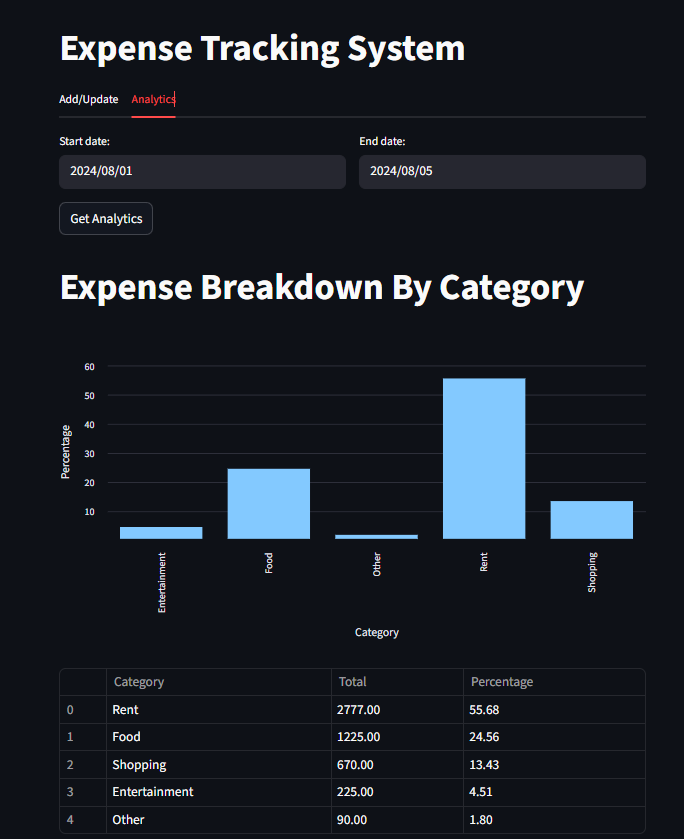

# 💰 Expense Tracking System

An **Expense Tracking System** built using **Python**, **Streamlit**, and **FastAPI** that helps users **manage, analyze, and visualize** their spending habits efficiently.  
It provides an intuitive interface to **add, update, and view expenses**, attach **notes**, and view **category-wise analytics** (including total spent and percentage breakdown) with a **visual bar chart** representation.

---

## 🖥️ Project Overview

The **Expense Tracking System** simplifies managing daily expenses by allowing users to input transactions along with categories and notes.  
It also offers powerful analytics for a selected date range, showing:
- Total amount spent per category
- Percentage share of each category
- A clean, interactive **bar chart visualization**

The system supports persistent data storage using **MySQL** and ensures smooth integration between backend and frontend via **FastAPI**.

---

## ⚙️ Tech Stack & Libraries Used

| Technology / Library | Purpose |
|----------------------|----------|
| **Python** | Core programming language used for the entire project |
| **Streamlit** | Used for building the interactive web-based frontend interface |
| **Pandas** | Used for managing, processing, and analyzing tabular expense data |
| **Pydantic** | Used for validating data models in the backend (FastAPI) |
| **FastAPI** | Provides the backend API endpoints for managing and retrieving expense data |
| **Requests** | Used for making API calls between the Streamlit frontend and FastAPI backend |
| **mysql-connector-python** | Used to connect and interact with the MySQL database where expenses are stored |
| **Pytest** | Used for writing and running automated backend tests |

---

## 🌟 Main Features

### 🔹 Add / Update Expenses
- Enter the **amount**, **category**, and **notes** for each expense.
- Modify or add new entries dynamically.
- Supports categories like Rent, Food, Shopping, Entertainment, and more.

### 🔹 Category Selection
- Choose predefined categories via dropdown menus.
- Easily editable and extendable for new categories.

### 🔹 Notes Field
- Add custom notes for each expense entry (e.g., "Groceries for the week" or "Monthly rent payment").

### 🔹 Expense Analytics
- Select a **date range** to view summarized analytics.
- Displays a **bar chart** showing percentage share of each category.
- A **table view** lists category-wise totals and percentages for quick reference.

### 🔹 Persistent Data Storage
- All expense entries are stored securely in a **MySQL database**.

### 🔹 Automated Testing
- Backend routes and logic are verified using **Pytest** to ensure reliability.

---

## 📊 Example Screenshots

### ➕ Add/Update Expenses


### 📈 Analytics Dashboard


---

## 🚀 How to Run the Project

### 1️⃣ Clone the Repository
```
git clone https://github.com/4nshhh/Expense-Tracking-System.git
cd Expense-Tracking-System
```

### 2️⃣ Install Dependencies
```
pip install -r requirements.txt
```

### 3️⃣ Run the Backend (FastAPI)
```
cd "./backend"
uvicorn backend.server:app --reload
```
### 4️⃣ Run the Frontend (Streamlit)
```
cd "./frontend"
streamlit run app.py
```

### 🧑‍💻 Author

**GitHub**: [4nshhh](https://github.com/4nshhh)


### 📚 Future Improvements

* Add authentication (login/signup)

* Export analytics reports as PDF/CSV

* Add pie chart visualization

* Enable category customization
